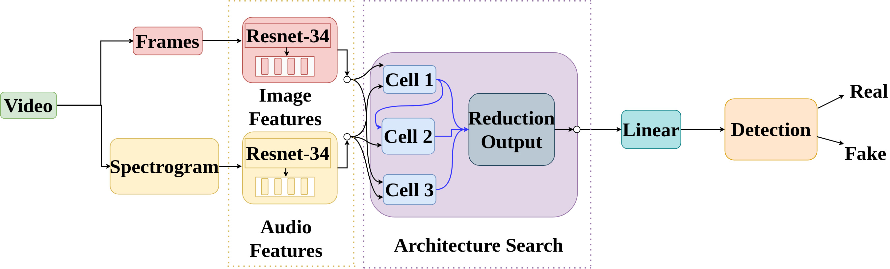
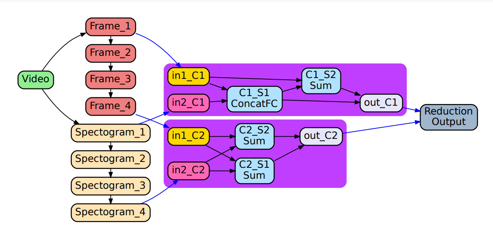
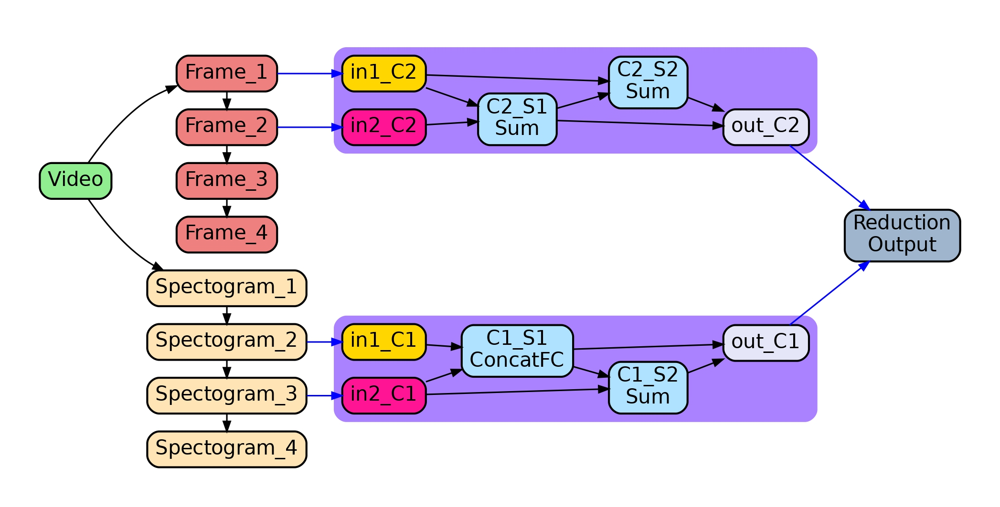
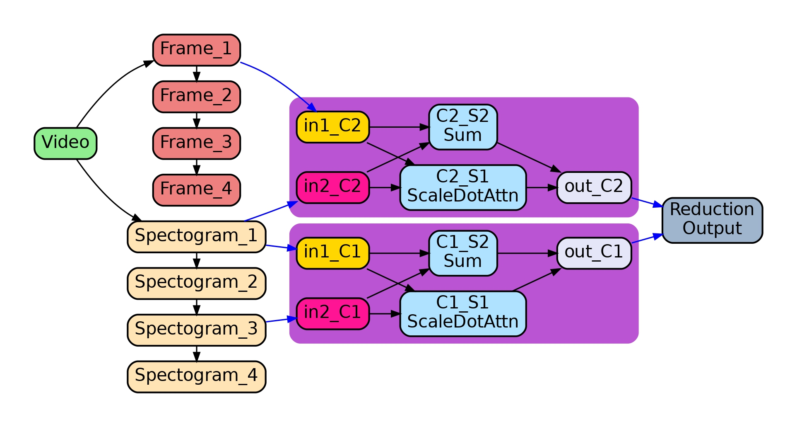
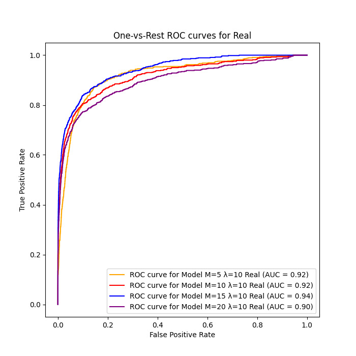
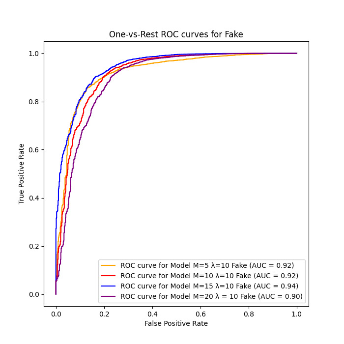
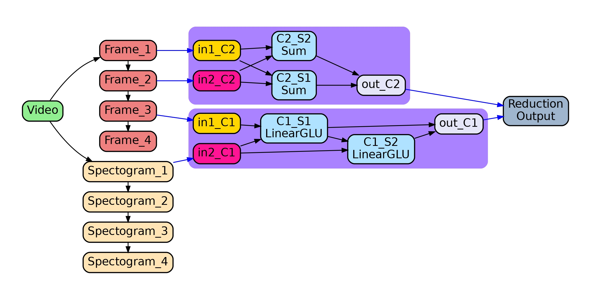
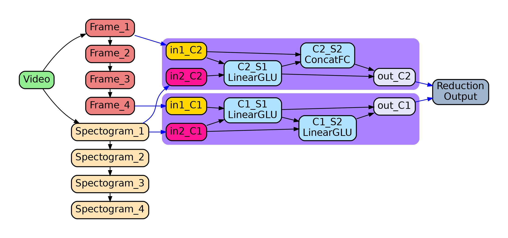

# STGS-BMNAS: Straight Through Gumbel Softmax Estimator based Bimodal Neural Architecture Search for Audio-Visual Deepfake Detection
## International Joint Conference on Biometrics(IJCB)-2024 [[paper]](https://arxiv.org/pdf/2406.13384)
# Architecture diagram

  
  
<em>Fig: Block diagram indicating the multimodal fusion network proposed by STGS-BMNAS, which consists of two level searching
scheme. In the first level we search for features from backbone network. Each cell accepts two inputs from its previous cells. In the second
stage we search for optimal architecture searched using our proposed STGS-BMNAS over the cells through pool primitive operations and finally
concatenate the cell outputs for prediction.</em>

# Requriments
    python >=3.6, pytorch==1.5.0 torchvision==0.6.0
# Datasets
 We used two datasets FakeAVCeleb [Link](https://docs.google.com/forms/d/e/1FAIpQLSfPDd3oV0auqmmWEgCSaTEQ6CGpFeB-ozQJ35x-B_0Xjd93bw/viewform) and SWAN-DF [Link](https://zenodo.org/records/8365616)
# Dataset pre-processing
## Video Preprocessing:
  ### First, run the following script to reshape all RGB videos to 256x256 with 30 fps.
     python3 datasets/prepare_ntu.py --dir=<dir_of_RGB_video>
## Audio pre-processing
  ### Extract all the audio files of the respective video and then create a source.txt file that contains the file name of all audio files in the npy extension and their path.
      python3 preprocess_1.py
  ### Now keep all the videos in one directory and audio files in another directory but the same parent directory and run
      python compute_mean_std.py
  ### Create a “label2.txt” file that contains the video name along with their actual labels.
# Run Experiment:
 ## First, search the hypernets. You can use --parallel for data-parallel. The default setting will require about 128GB of GPU memory, you may adjust the --batch size according to gpu memory capacity.
      python main_darts_searchable_df.py –parallel
 ## Then train the searched fusion network. You need to assign the searching experiment by --search_exp_dir.
     python main_darts_found_df.py --search_exp_dir=<dir of search exp>
# Inference only
 ## If you want to just run the test process (no training of the fusion network), you can also use this script and need to assign both the searching and evaluation experiments directories.
     python main_darts_found_df.py --search_exp_dir=<dir of search exp> --eval_exp_dir=<dir of eval exp>
# Roc curve calculation:
    python3 get_auc_val.py
# Experiments
 ## Architecture obtained for FakeAVCeleb and SWAN-DF database

  <table>
    <tr>
      <td style="text-align:center">
        
         
        <em>Architecture obtained when trained on FakeAVCeleb database</em>
      </td>
      <td style="text-align:center">
        
         
        <em>Architecture obtained when trained on SWAN-DF database</em>
      </td>
    </tr>
  </table>

## Architecture obtained by mixing both database

  
  
<em>Optimal architecture obtained with temperature λ = 10
and sampling M=15 for second type of evaluation protocol</em>

## Roc curves

  <table>
    <tr>
      <td style="text-align:center">
        
         
        <em>ROC curve for Real class with constant temperature
parameter λ = 10 and varying sampling values M</em>
      </td>
      <td style="text-align:center">
        
         
        <em>ROC curve for Fake class with constant temperature
parameter λ = 10 and varying sampling values M</em>
      </td>
    </tr>
  </table>

## Ablation study

  <table>
    <tr>
      <td style="text-align:center">
        
         
        <em>Architecture derived with λ=5 and M=15</em>
      </td>
      <td style="text-align:center">
        
         
        <em>Architecture derived with λ=5 and M=5</em>
      </td>
    </tr>
  </table>

## Pre-trained models
coming soon

## Acknowledgments
BMNAS(https://github.com/Somedaywilldo/BM-NAS)

